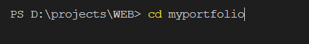

PORTFOLIO SETUP AND REVIEW:

Go to your current directory you wish to create your project

after that go to myportfolio directory

after that run 

* git clone [gnvvs-07/GNVVS (github.com)](https://github.com/gnvvs-07/GNVVS)
* npm i
* add .env file in your project directory and add your github access token and git hub profile username
* npm run dev
